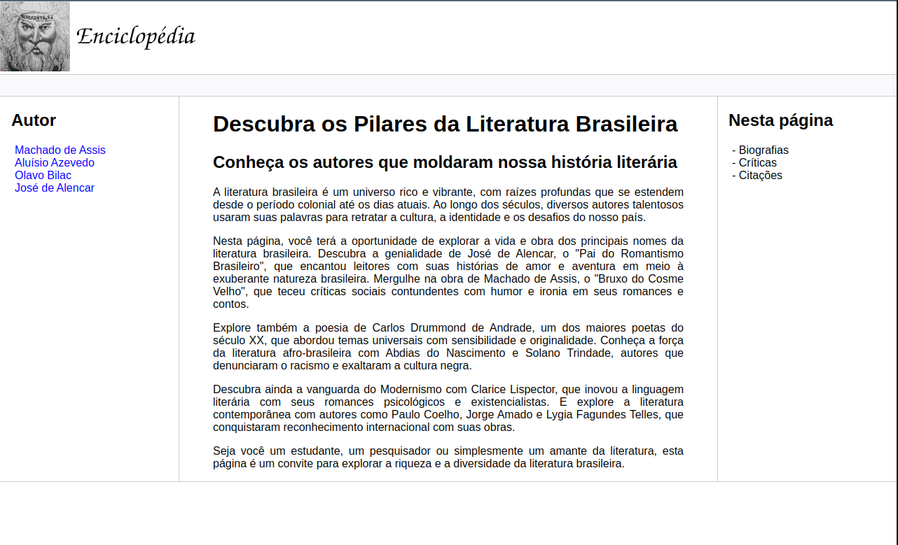
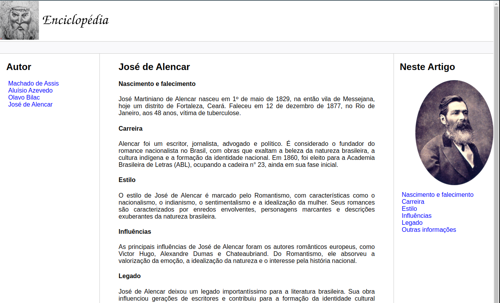

<h1>
    
    Formação HTML Web Developer
</h1>

# :computer: Recriando o Wikipedia com Layout Moderno

Este desafio consiste em treinar você com relação a estrutura do site, e também aplicar conhecimentos adiquiridos sobre semântica e acessibilidade.

Todo código-fonte desenvolvido durante o curso foi versionado no GitHub, no seguinte endereço:

https://github.com/digitalinnovationone/trilha-html-modulo-3

# :bulb: Solução do desafio

Desenvolvimento de um site html5 com 4 páginas.

* O logo foi gerado usando o Adobe Firefly. 

* O google Gemini ajudou no resumo dos conteúdos

* O wave não reportou nenhum erro de acessibilidade, porém alguns alertas quanto aos textos justificados.

* Index:

* José de Alencar:

